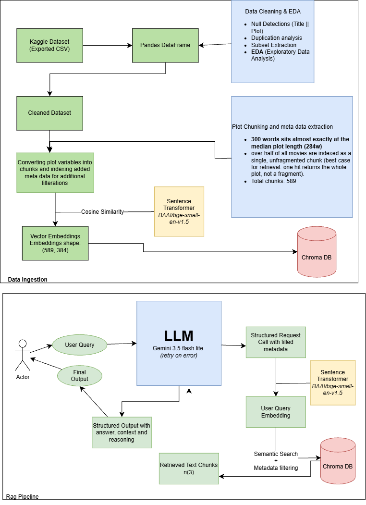

# TypeB Movie Plots Assignment — RAG Pipeline

Indexes a subset of the [Wikipedia Movie Plots](https://www.kaggle.com/datasets/jrobischon/wikipedia-movie-plots)
dataset into ChromaDB and answers natural-language questions over it with
Gemini, returning a structured, validated JSON answer.


[  ]


---

## 1. Data cleaning (`Rag_Pipeline.ipynb`, Steps 1–2)

**Load & subset** — `wiki_movie_plots_deduped.csv` is loaded with pandas, reduced to
`Title, Release Year, Genre, Director, Cast, Plot, Origin/Ethnicity`, rows with
null/empty `Title` or `Plot` are dropped (34,886 of ~34,886 rows survive — the raw
file is already nearly complete on those two fields), then **300 rows are
sampled** (`random_state=42`) as the working subset.

**Clean & normalize:**

| field | rule |
|---|---|
| `Genre` | split on `/` and `,`, lowercase, strip → list, capped at 3 |
| `Cast` | split on `,` → list, capped at 3 |
| `Director` | split on `,` (co-directors) → list, capped at 3; `"Unknown"`/empty → `[]` |
| `Origin/Ethnicity` | split on `/` and `,`, lowercase, strip → list, capped at 3; `"Unknown"`/empty → `[]` |
| `Release Year` | coerced to numeric, non-parseable rows dropped, cast to `int` |
| `Plot` | citation artifacts (`[1]`, `[edit]`, `[citation needed]`) stripped via regex, whitespace/newlines collapsed |

**Duplicate resolution (Step 2b)** — rows sharing the exact same `(Title, Release Year)`
are either the same movie (a split/duplicated scrape) or two different movies that
happen to collide on title+year. `Director` (now a list) is used as the tiebreaker
via **set intersection**: overlapping directors → merge the distinct plot text into
one row; non-overlapping directors → keep both rows separate, and Step 3's id
generation appends a `_dupN` suffix so their chunk ids can never collide in Chroma.

**Metadata category reference (Step 2c)** — the actual distinct `genre` and `origin`
values present in the 300-row sample are computed and **written directly into
`query_planner_prompt.md`** (between `<!-- KNOWN_VALUES_START/END -->` markers), so
Gemini's query planner is given the real, closed vocabulary to pick from instead of
guessing spellings that won't match. `Director` has too many open-ended values to
usefully enumerate, so it stays free-text.

---

## 2. EDA — and why it drove the chunking decision

Run against the full ~34.9k-row cleaned corpus (not just the 300-row sample), so the
numbers reflect the real dataset:

| stat | value |
|---|---|
| median plot length | 284 words |
| mean plot length | 372 words (long right tail, max 6,752) |
| % of plots > 300 words | 48.3% |
| median sentences/plot | 15 |
| mean words/sentence | ~20 |

A direct BGE-small tokenizer pass (not a word-count estimate) confirmed:
- **39.6%** of *full, unchunked* plots already exceed BGE-small's 512-token limit —
  chunking isn't optional, it's required to avoid silent embedding truncation.
- A **300-word chunk slice** costs a median of 358 tokens, 99th percentile 464 —
  only **0.10%** of 300-word slices exceed the 512-token limit, and even those
  overshoot by just ~20 tokens.

### Chunk size decision: `target_words=300`, `overlap_words=50`

- **300 words sits almost exactly at the median plot length (284w)** — over half
  of all movies are indexed as a single, unfragmented chunk (best case for
  retrieval: one hit returns the whole plot, not a fragment).
- **~15 sentences** at ~20 words/sentence — matches the median plot's sentence
  count, so a "typical" plot naturally becomes one chunk rather than an arbitrary
  cut.
- **Safely under BGE-small's 512-token ceiling** (99.9% of the time, empirically
  measured) with headroom before truncation risk becomes real (~380–400 words is
  roughly where that risk starts to matter).
- **50-word overlap ≈ 2–3 sentences** — enough trailing context to bridge a chunk
  boundary without the overlap dominating the chunk.

Chunking itself (`chunk_text()`, Step 3) is **sentence-aware** (`nltk.sent_tokenize`):
sentences accumulate until the next one would push the running total past 300
words, at which point the chunk is closed, and whichever *whole trailing sentences*
fit under a 50-word budget seed the next chunk. A sentence is never split across
chunks — if a single sentence alone exceeds the overlap budget, that boundary
simply gets less (occasionally zero) overlap rather than being cut.

---

## 3. Why `BAAI/bge-small-en-v1.5`

- **Asymmetric retrieval model** — trained specifically so a query-side instruction
  prefix ("Represent this sentence for searching relevant passages: ") and
  unprefixed stored passages embed into a space suited for query→passage
  retrieval, not just generic sentence similarity.
- **Cosine-similarity trained** — matches Chroma's collection configured with
  `metadata={"hnsw:space": "cosine"}`, and embeddings are L2-normalized
  (`normalize_embeddings=True`) accordingly.
- **Small and CPU-friendly** — 384-dim output, runs fast locally with no per-call
  API cost, appropriate for a self-contained indexing pipeline over a bounded
  dataset subset.
- **512-token context** is large enough for the chosen ~300-word chunk size (see
  the EDA validation above), with negligible truncation risk.

---

## 4. RAG pipeline (`Rag_Pipeline.ipynb`, Steps 3–8)

1. **Chunk** (Step 3) — sentence-aware 300-word/50-word-overlap chunks (see §2).
   Each chunk gets a metadata dict — `title`, `year`, `chunk_index` (scalars) plus
   `genre`/`director`/`origin` **as lists** whenever known (filterable via
   Chroma's `$contains` operator — verified directly against the installed
   chromadb, see the notebook's Step 2 change note for details; empty lists are
   rejected by Chroma on upsert, so an empty category simply omits that key) —
   and a stable id `f"{slug(title)}_{year}[_dupN]_{chunk_index}"`.
2. **Embed** (Step 4) — `sentence-transformers` batch-encodes all chunk documents
   (`batch_size=32`, `tqdm` progress bar, `normalize_embeddings=True`). No query
   prefix here — that only applies at retrieval time.
3. **Store** (Step 5) — `chromadb.PersistentClient(path="./chroma_db")`, collection
   `movie_plots` (`hnsw:space: cosine`), upserted in batches of 32
   (ids/documents/embeddings/metadatas).
4. **Sanity check** (Step 6) — one query exercising both embedding search and
   `where={"genre": {"$contains": ...}}` metadata filtering end-to-end.
5. **Persist & handoff** (Steps 7–8) — reopens the DB with a fresh client to prove
   it survived to disk, then prints the resolved path/collection/count that
   `query_gemini.py` expects by default.

---

## 5. Query CLI & LLM routing (`query_gemini.py`)

A three-stage pipeline, each stage routed through Gemini or Chroma independently,
with its own failure handling:

### Stage 1 — Plan (`plan_retrieval`, Gemini call #1)
The raw user question is sent to Gemini with **`query_planner_prompt.md`**, which
lists every metadata field (`title`, `year`, `genre`, `director`, `origin`,
`chunk_index`) with its type/semantics and the actual known `genre`/`origin`
vocabulary (auto-injected by the notebook's Step 2c). Gemini returns a structured
`RetrievalPlan` (`response_schema`-enforced): a rewritten `search_query` optimized
for semantic search, plus whichever filter fields the question actually implies —
everything else stays `null`.
**Routing on failure:** any exception here (bad API response, malformed JSON,
network error) is caught, and the pipeline **falls back to an unfiltered plan**
using the raw question — it never aborts at this stage.

### Stage 2 — Retrieve (`retrieve`, Chroma)
`build_where()` turns the plan's non-null fields into a real Chroma `where` clause
— `$contains` for the list-valued `genre`/`director`/`origin`, `$eq`/`$gte`/`$lte`
for scalar `title`/`year`. The query text is embedded with BGE-small (with the
query instruction prefix) and searched against `movie_plots`.
**Routing on empty results:** if the filtered search returns nothing, it is
**automatically retried once with no filter at all** — covers both a bad LLM
filter guess and a legitimately-too-narrow filter. Only if the unfiltered retry is
*also* empty does the CLI exit with an error.

### Stage 3 — Answer (`ask_gemini` + `validate_response`, Gemini call #2)
Retrieved chunks are formatted into **`prompt_template.md`** (instructs
"answer only from the given excerpts," with the exact `{answer, contexts,
reasoning}` JSON shape as a guide) and sent to Gemini, again with
`response_schema=RagResponse` enforcing structure at the API level.
**Validation before the user ever sees it:** `validate_response()` additionally
rejects an empty `answer`/`reasoning` or a malformed `contexts` list. Unlike
Stage 1, there's no safe fallback for a bad final answer, so a failure here exits
with a clear error message instead of printing something unreliable.

Model used for both Gemini calls: **`gemini-3.5-flash-lite`** — lowest-cost,
lowest-latency tier in the current Gemini lineup, sufficient for structured
extraction/generation tasks like these. Note: this model deprecates
`temperature`/`top_p`/`top_k` (the API errors if they're set), so the script
intentionally omits them.

All diagnostic logging (`[planner] ...`, `[retrieval] ...`) goes to **stderr**;
**stdout carries only the final JSON**, so the CLI's output is safe to pipe.

```bash
python query_gemini.py "What movie features an AI that turns against its crew?"
python query_gemini.py "What happens in the plot of Titanic?" --n-results 5
python query_gemini.py "a heist movie" --genre "drama"   # manual override
```

---

## 6. Repo layout

| file | role |
|---|---|
| `Rag_Pipeline.ipynb` | ingestion/indexing only — load → EDA → clean → chunk → embed → store |
| `query_gemini.py` | retrieval + generation CLI (plan → retrieve → answer) |
| `query_planner_prompt.md` | Stage-1 prompt: NL question → structured retrieval plan |
| `prompt_template.md` | Stage-3 prompt: retrieved context → structured `{answer, contexts, reasoning}` |
| `requirements.txt` | pinned dependencies for both the notebook and the CLI |
| `.env.example` | template for `GEMINI_API_KEY` (copy to `.env`, which is gitignored) |
| `chroma_db/` | persistent ChromaDB collection (created by the notebook) |
| `wiki_movie_plots_deduped.csv` | the dataset (download separately — see below, not checked into git) |

---

## 7. Reproducing this on a new machine

1. **Get the code** — copy/clone this project directory.

2. **Python** — 3.10+ recommended. Create and activate a virtual environment:
   ```bash
   python -m venv .venv
   # Windows:
   .venv\Scripts\activate
   # macOS/Linux:
   source .venv/bin/activate
   ```

3. **Install dependencies:**
   ```bash
   pip install -r requirements.txt
   ```

4. **Get the dataset** — download `wiki_movie_plots_deduped.csv` from
   [Kaggle: jrobischon/wikipedia-movie-plots](https://www.kaggle.com/datasets/jrobischon/wikipedia-movie-plots)
   and place it in the project root (alongside `Rag_Pipeline.ipynb`).

5. **Set up your Gemini API key:**
   ```bash
   cp .env.example .env
   ```
   Edit `.env` and set:
   ```
   GEMINI_API_KEY=your-real-key-here
   ```

6. **Run the notebook end-to-end**, top to bottom, in Jupyter/VS Code/etc.:
   ```bash
   jupyter notebook Rag_Pipeline.ipynb
   ```
   This downloads NLTK's `punkt`/`punkt_tab`/`stopwords` data on first run, cleans
   and chunks the sampled 300 rows, embeds them with BGE-small (first run also
   downloads the model from Hugging Face — a few hundred MB), and builds
   `./chroma_db/` with the `movie_plots` collection. Step 2c also (re)writes the
   known-values section of `query_planner_prompt.md` to match whatever ends up
   indexed.

7. **Query it:**
   ```bash
   python query_gemini.py "What movie features an AI that turns against its crew?"
   ```
   First run also downloads BGE-small if the notebook wasn't run in the same
   environment. Output is a single JSON object on stdout:
   ```json
   {
     "answer": "...",
     "contexts": ["..."],
     "reasoning": "..."
   }
   ```

**Re-running after changes:** if you resample the dataset, change the chunk
size/metadata schema, or otherwise reindex, delete `chroma_db/` (or rerun with a
different `--chroma-path`) and rerun the notebook from Step 1 — the schema for
`genre`/`director`/`origin` (list-valued, `$contains`-filtered) must match between
what's indexed and what `query_gemini.py` queries against.

---

## 8. Known limitations

- Only the 300 sampled rows are indexed — the other ~34.6k cleaned rows exist in
  the notebook's `df` during a run but are never chunked/embedded/stored.
- `genre`/`director`/`origin` filters are **exact-match-per-list-element**
  (`$contains`), not fuzzy/substring — a value not in Step 2c's known-values list
  (for genre/origin) simply won't match, which is why the CLI auto-retries
  unfiltered on an empty result rather than failing outright.
- `Cast` is cleaned in the notebook but not currently carried into chunk metadata
  or made filterable.
